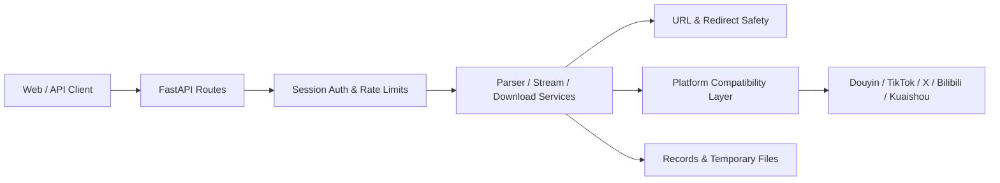

# Douyin Downloader Refactored

[](https://www.python.org/)
[](https://fastapi.tiangolo.com/)
[](https://docs.astral.sh/ruff/)
[](https://mypy-lang.org/)

面向生产部署的多平台媒体解析与下载服务。项目以 FastAPI 为应用层，在保留已验证平台适配逻辑的同时，补充认证、SSRF 防护、资源限制、健康检查、测试和 Linux 部署配置。

> [!IMPORTANT]
> 本项目仅用于处理你有权访问和保存的内容。使用者应自行遵守平台条款、著作权规定及所在地区法律。请勿用于绕过访问控制、批量滥用或未经授权的数据采集。

## 功能概览

- 支持抖音、TikTok、X/Twitter、Bilibili 和快手。
- 支持视频、普通图集和抖音动态图片（live photo）。
- 提供解析、Range 流式播放和文件下载 API。
- 抖音默认使用 f2 API；失败后只切换一次 Cookie，不回退网页爬虫。
- 抖音短链从首次 302 跳转直接提取作品 ID，减少额外页面请求。
- 启动阶段默认预热 f2，降低首个抖音请求的初始化延迟。
- 仅 TikTok 和 X/Twitter 使用配置代理，国内平台保持直连。
- 邀请码会话保护高资源接口，管理后台默认关闭。
- 对输入 URL、每次重定向、DNS 解析和目标 IP 进行 SSRF 校验。
- 提供并发限制、流量上限、磁盘空间检查和临时文件清理。
- 提供 liveness/readiness 健康检查、CI、systemd 和灰度迁移文档。

## 平台策略

| 平台 | 解析方式 | 代理策略 | 说明 |
|---|---|---|---|
| 抖音 | f2 API only | 直连 | 首次失败后更换另一组 Cookie，仅重试一次 |
| TikTok | 页面解析 + ssstiktok | 使用配置代理 | 网络质量会明显影响解析耗时 |
| X/Twitter | fxtwitter API | 使用配置代理 | 支持 MP4 和 m3u8 下载回退 |
| Bilibili | 官方 Web API | 直连 | 流媒体请求自动携带 Referer |
| 快手 | 移动分享页解析 | 直连 | 网络错误有限重试一次 |

## 架构



```text
src/app/
├── api/                 HTTP 路由和依赖注入
├── core/                配置、安全、日志和中间件
├── infrastructure/      URL 校验、限流、存储和安全 HTTP
├── legacy/              已验证的平台解析/下载兼容层
├── services/            解析、流式、下载、认证和记录服务
├── lifespan.py          启动清理与 f2 预热
└── main.py              FastAPI 应用工厂

tests/                   单元、契约和安全测试
web/static/              本地化前端与静态资源
deploy/systemd/          Linux systemd 示例
docs/                    架构、配置、安全、部署和验证文档
```

## 快速开始

### 环境要求

- Python 3.11 或更高版本
- ffmpeg（涉及媒体合成或 m3u8 下载时需要）
- Chromium/Edge（仅部分兼容链路需要）

### Windows / PowerShell

```powershell
git clone <repository-url>
Set-Location douyin-downloader-refactor

py -3.11 -m venv .venv
.\.venv\Scripts\Activate.ps1
python -m pip install --upgrade pip
python -m pip install -r requirements-dev.txt

Copy-Item config.example.yaml config.yaml
# 编辑 config.yaml，设置开发邀请码及所需平台 Cookie

python -m uvicorn app.main:app --app-dir src --host 127.0.0.1 --port 9000
```

### Linux / macOS

```bash
git clone <repository-url>
cd douyin-downloader-refactor

python3.11 -m venv .venv
. .venv/bin/activate
python -m pip install --upgrade pip
python -m pip install -r requirements-dev.txt

cp config.example.yaml config.yaml
# 编辑 config.yaml，设置开发邀请码及所需平台 Cookie

python -m uvicorn app.main:app --app-dir src --host 127.0.0.1 --port 9000
```

访问 <http://127.0.0.1:9000>，输入配置的邀请码即可使用。

安装 Playwright 浏览器（可选）：

```bash
python -m playwright install chromium
```

## 配置

配置优先级为：**环境变量 > `config.yaml` > 代码默认值**。

生产环境至少需要：

```dotenv
DOUYIN_APP_ENV=production
DOUYIN_SESSION_SECRET=replace-with-at-least-32-random-characters
DOUYIN_INVITE_CODES=replace-with-real-invite-codes
DOUYIN_SECURE_COOKIES=true
DOUYIN_F2_PREWARM_ENABLED=true
```

常用配置：

| 环境变量 | 默认值 | 用途 |
|---|---:|---|
| `DOUYIN_HOST` | `127.0.0.1` | 监听地址 |
| `DOUYIN_PORT` | `9000` | 监听端口 |
| `DOUYIN_INVITE_CODES` | 空 | 逗号分隔的邀请码 |
| `DOUYIN_INVITE_AUTH_ENABLED` | `true` | 是否要求邀请码会话；公开站点可设为 `false` |
| `DOUYIN_SESSION_SECRET` | 开发环境临时生成 | Session 签名密钥，生产至少 32 字符 |
| `ADMIN_USER` | `admin` | 管理员用户名 |
| `ADMIN_PASS` | 空 | 管理员密码；为空时后台禁用 |
| `ADMIN_EXTERNAL_URL` | 空 | 将本实例后台页面重定向到共享管理后台 |
| `DOUYIN_HTTP_PROXY` | 空 | 仅供 TikTok 和 X/Twitter 使用的 HTTP 代理 |
| `DOUYIN_F2_PREWARM_ENABLED` | `true` | 启动时预热抖音 f2 请求栈 |
| `DOUYIN_METADATA_CACHE_TTL_SECONDS` | `600` | 成功解析结果的进程内缓存时间 |
| `DOUYIN_PRELOAD_ENABLED` | `false` | 是否启用受限智能预下载 |
| `DOUYIN_PRELOAD_PLATFORMS` | `douyin` | 允许智能预下载的平台列表 |
| `DOUYIN_PRELOAD_MAX_DURATION_SECONDS` | `180` | 只预下载不超过该时长的普通视频 |
| `DOUYIN_PRELOAD_MAX_BYTES` | 100 MiB | 单个预下载文件的硬上限 |
| `DOUYIN_RECORDS_FILE` | 空 | 可选的共享解析记录 JSONL 路径 |
| `DOUYIN_MAX_STREAM_BYTES` | 1 GiB | 单次流式响应上限 |
| `DOUYIN_MAX_DOWNLOAD_BYTES` | 1 GiB | 单次文件下载上限 |
| `DOUYIN_SECURE_COOKIES` | `false` | HTTPS 生产环境必须设为 `true` |

完整示例见 [config.example.yaml](config.example.yaml)、[.env.example](.env.example) 和 [配置文档](docs/CONFIGURATION.md)。真实 Cookie、密钥和代理凭据必须放在不入库的 `config.yaml`、systemd `EnvironmentFile` 或外部 Secret Manager 中。

## API 与健康检查

| 路径 | 方法 | 认证 | 用途 |
|---|---|---|---|
| `/api/verify-invite` | POST | 无 | 验证邀请码并建立会话 |
| `/api/parse` | POST | 邀请码会话 | 解析媒体元数据 |
| `/api/stream` | GET | 邀请码会话 | 支持 Range 的流式代理 |
| `/api/download/*` | GET/POST | 邀请码会话 | 下载媒体或生成文件 |
| `/api/admin/login` | POST | 无 | 管理员登录 |
| `/api/admin/records` | GET | 管理员会话 | 查询解析记录 |
| `/health/live` | GET | 无 | 进程存活检查 |
| `/health/ready` | GET | 无 | 依赖和目录就绪检查 |

为了缩小生产攻击面，Swagger、ReDoc 和 OpenAPI JSON 默认关闭。

## 开发与测试

```powershell
python -m pytest
python -m ruff check src tests
python -m ruff format --check src tests
python -m mypy src
```

测试默认不应访问真实平台。CI 中会关闭 f2 预热，真实 Cookie、Playwright、ffmpeg 和各平台 live 行为应在隔离的灰度环境中验证。

## 生产部署

当前生产环境的域名、端口、服务、Cookie 轮换、发布、故障处理和回滚流程见
[生产交接文档](docs/HANDOVER.md)。

仓库提供单 worker 的 systemd 示例：

```bash
sudo cp deploy/systemd/app.service /etc/systemd/system/douyin-downloader-refactor.service
sudo mkdir -p /etc/douyin-downloader-refactor
sudo cp deploy/systemd/app.env.example /etc/douyin-downloader-refactor/app.env
sudo editor /etc/douyin-downloader-refactor/app.env

sudo systemctl daemon-reload
sudo systemctl enable --now douyin-downloader-refactor
sudo systemctl status douyin-downloader-refactor
```

当前建议保持 `--workers 1`，因为兼容层仍包含进程内缓存、Cookie 轮换状态和浏览器池。公网部署建议使用 Cloudflare Tunnel 或反向代理，仅暴露 HTTPS 入口，不直接开放应用端口。

可选的 `cleanup.timer` 每 5 分钟清理超过 15 分钟的临时文件，`healthcheck.timer` 每 2 分钟检查应用存活状态并尝试恢复服务。安装方法见部署文档。智能预下载默认只接受抖音普通视频，并同时受 3 分钟时长、100 MiB 单文件、1 个后台任务、20 个缓存条目和 512 MiB 总占用限制；长视频、图文、动图及未知时长内容不会预下载。

详细步骤见 [部署文档](docs/DEPLOYMENT.md) 和 [迁移清单](MIGRATION.md)。

## 安全说明

- 所有服务端请求仅允许已登记的平台域名，并拒绝私网、环回、链路本地和云元数据地址。
- 每次上游重定向都会重新校验 URL，跨平台重定向会被拒绝。
- 管理后台没有密码时默认关闭，不存在“空密码开放”模式。
- 生产模式缺少稳定 Session 密钥、邀请码或 Secure Cookie 时拒绝启动。
- 不要提交 `config.yaml`、`.env`、Cookie、私钥、Cloudflare Token、日志或下载文件。

发现安全问题时，请不要在公开 Issue 中提交 Cookie、密钥、可利用载荷或真实服务器信息。先通过仓库维护者提供的私密联系方式报告。更多信息见 [安全文档](docs/SECURITY.md)。

## 贡献

欢迎提交 Issue 和 Pull Request。建议流程：

1. Fork 仓库并从最新主分支创建功能分支。
2. 将改动限制在单一问题范围内。
3. 为修复或新行为补充单元、契约或安全测试。
4. 运行 Pytest、Ruff 和 mypy。
5. 在 PR 中说明行为变化、验证结果、风险和回滚方式。

平台页面和接口经常变化。提交平台适配修复时，请避免附带真实 Cookie，并尽量使用脱敏响应、最小复现和不访问真实上游的测试。

## 项目状态与限制

- 平台适配核心仍位于 `src/app/legacy`，应用边界已重构，但尚未把每个平台完全改写为独立适配器。
- TikTok 解析依赖境外网络和第三方页面，速度与稳定性受代理质量影响。
- 解析缓存和部分状态位于进程内，暂不适合直接扩展为多 worker。
- 本仓库暂不提供 Docker 镜像。
- 外部平台变化可能导致 live 测试结果与离线测试不同。

路线与历史变更见 [CHANGELOG.md](CHANGELOG.md)，重构边界见 [架构文档](docs/ARCHITECTURE.md) 和 [审计报告](docs/REFACTOR_AUDIT.md)。

## License

当前仓库尚未包含 `LICENSE` 文件。在正式添加许可证前，代码默认保留所有权利；请勿假定可以重新分发或用于商业用途。
