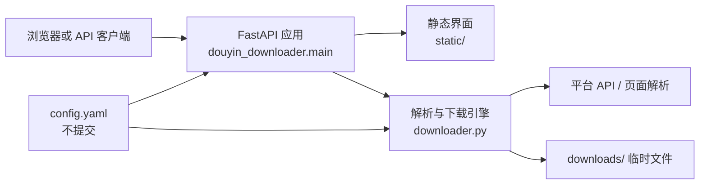

# SalaryMeow Downloader

SalaryMeow Downloader 是一个基于 FastAPI 的多平台媒体解析与下载服务，提供网页界面、HTTP API、流式响应和本地文件下载。

当前项目版本：`1.0.1`。界面中的 “UI 3.0” 仅表示前端样式版本，不是项目版本。

## 在线演示

- [https://fzpnowm.top](https://fzpnowm.top)

公开演示可能启用邀请码、访问频率或平台侧限制；本地部署不依赖演示站点。

## 核心能力

- 解析公开视频、图片、图集和部分实况照片
- 提供 `/api/parse`、`/api/stream` 和 `/api/download` 接口
- 支持 HTTP Range 流式响应
- 提供三套现有网页界面：`/`、`/v1`、`/v2`
- 可选管理员登录、邀请码访问控制和解析记录
- 对流式目标执行协议、域名和内网地址校验
- 通过 `config.yaml` 统一管理代理、Cookie、CORS、认证和运行参数

## 支持平台

| 平台 | 当前实现 |
| --- | --- |
| 抖音 | 视频、图集、实况照片；f2 优先并带页面解析回退 |
| TikTok | 视频；TikTokApi 与网页解析 |
| Bilibili | 视频解析与下载 |
| Twitter / X | 视频和图片；通过公开解析接口获取媒体信息 |
| 快手 | 视频解析与下载 |

平台页面和上游接口会变化；Cookie、网络区域和可选依赖都会影响实际成功率。

## 系统架构



`src/douyin_downloader/` 是规范代码源。根目录的 `main.py`、`downloader.py`、`douyin_api.py`、`config.py` 和 `utils.py` 暂时保留，供仍以 `main:app` 启动的旧部署兼容；它们不是新开发入口。

## 本地安装

要求 Python 3.9 或更高版本。FFmpeg 用于部分媒体合成；Playwright Chromium 用于需要浏览器回退的解析路径。

```powershell
git clone https://github.com/f3271174706-tech/SalaryMeow-Downloader.git
Set-Location SalaryMeow-Downloader
python -m venv .venv
.\.venv\Scripts\Activate.ps1
python -m pip install --upgrade pip
python -m pip install -e ".[dev,full]"
python -m playwright install chromium
Copy-Item config.yaml.example config.yaml
```

Linux 或 macOS：

```bash
git clone https://github.com/f3271174706-tech/SalaryMeow-Downloader.git
cd SalaryMeow-Downloader
python3 -m venv .venv
source .venv/bin/activate
python -m pip install --upgrade pip
python -m pip install -e ".[dev,full]"
python -m playwright install chromium
cp config.yaml.example config.yaml
```

安装完成后的标准开发启动命令：

```bash
python -m uvicorn douyin_downloader.main:app --host 0.0.0.0 --port 8001 --reload
```

随后访问 [http://localhost:8001](http://localhost:8001)。安装生成的 CLI 也可通过 `salarymeow-downloader` 启动，监听参数取自 `config.yaml`。

## 配置方法

复制 `config.yaml.example` 为 `config.yaml` 后再编辑。真实配置已被 `.gitignore` 排除。

```yaml
app:
  cors_origins:
    - "http://localhost:3000"

auth:
  admin_user: "admin"
  admin_password: ""
  invite_code: ""
  secure_cookies: false

network:
  proxy: ""

cookies:
  douyin: ""
  tiktok: ""
```

- `network.proxy` 为空时直接连接；如需代理，填写完整代理 URL。
- `app.cors_origins` 是允许访问 API 的来源列表，不要在公开部署中无必要地使用 `"*"`。
- `auth.admin_password` 为空时管理员功能不可用。
- `auth.invite_code` 为空时不启用站点邀请码。
- 直接以 HTTPS 提供服务时，将 `auth.secure_cookies` 设为 `true`；纯本地 HTTP 开发保持 `false`。
- Cookie 只应放在本地 `config.yaml` 中，不应提交、粘贴到 Issue 或写入日志。
- `ADMIN_USER`、`ADMIN_PASS` 和 `DIRECT_INVITE_CODE` 环境变量可覆盖对应认证配置。仓库的 `.env.example` 只是变量名示例；Uvicorn 不会自动读取 `.env`，生产环境应由服务管理器注入变量。

## API 示例

解析媒体：

```bash
curl -X POST http://127.0.0.1:8001/api/parse \
  -H "Content-Type: application/json" \
  -d '{"url":"https://www.douyin.com/video/EXAMPLE"}'
```

下载媒体：

```bash
curl -X POST http://127.0.0.1:8001/api/download \
  -H "Content-Type: application/json" \
  -d '{"url":"https://www.douyin.com/video/EXAMPLE","quality":"1080p","type":"video"}' \
  --output media.bin
```

流式接口使用查询参数 `video_url`，并只接受代码白名单中的 HTTP/HTTPS 媒体域名。不要把用户输入绕过 `/api/parse` 后直接代理到任意地址。

## 测试方法

```bash
python -m pip install -e ".[dev,full]"
ruff check .
ruff format --check .
pytest
python -c "from douyin_downloader.main import app; print(app.title)"
```

手工检查单个抖音分享页中的媒体地址：

```bash
python scripts/check_url.py "https://www.douyin.com/video/EXAMPLE"
```

该手工脚本会访问外部页面，不属于离线 pytest 测试。

## 部署说明

通用的 systemd、反向代理和旧入口迁移步骤见 [docs/DEPLOY.example.md](docs/DEPLOY.example.md)。仓库没有经过验证的 Dockerfile，因此不提供 Docker 命令。

生产部署应使用不带 `--reload` 的命令，并在反向代理后只监听内网接口。若服务器仍运行 `uvicorn main:app`，先按部署文档在独立端口验证规范入口，再修改服务配置；在确认线上入口完成迁移前，不要删除根目录兼容实现。

## 安全及使用边界

- 仅下载你有权访问、保存和使用的内容，并遵守平台条款、版权规则和所在地法律。
- 本项目不用于绕过付费、访问控制、数字版权管理或私密内容保护。
- 不要提交 Cookie、密码、邀请码、私钥、服务器地址或私有部署文档。
- 公开服务应设置强管理员密码、最小化 CORS 来源，并通过反向代理启用 HTTPS、访问控制和速率限制。
- 下载 URL 仍受上游平台控制。部署者应持续更新域名白名单和依赖，并审查日志中是否包含个人信息。
- 发现安全问题时，请通过仓库维护者提供的私下联系方式报告，不要在公开 Issue 中附带凭据。
