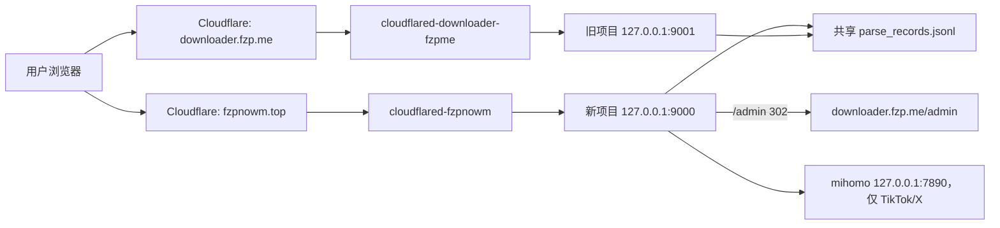

# SalaryMeow Downloader 生产交接文档

> 文档状态：可交接  
> 最后核对：2026-07-17（Asia/Shanghai）  
> 仓库：`f3271174706-tech/SalaryMeow-Downloader`  
> 主分支：`main`  
> 基线提交：`98a2c92`

## 1. 目的与保密边界

本文用于接管当前新旧两套下载服务，覆盖代码、生产拓扑、配置、Cookie 轮换、日常运维、发布、监控、故障处理和回滚。

本文不保存 SSH 私钥、Cloudflare Token、Tunnel credentials、平台 Cookie、Session Secret 或管理员密码的明文。接手人应从现有服务器私有文件或密码管理器取得秘密，禁止把秘密复制到 Git、工单、截图或聊天记录中。

## 2. 当前结论

- 正式主站是新重构项目：<https://fzpnowm.top>。
- 旧项目保留在：<https://downloader.fzp.me>。
- 新项目 `/admin` 跳转到旧项目共享后台：<https://downloader.fzp.me/admin>。
- 新旧项目共用 `/root/DOWN/logs/parse_records.jsonl`；新项目异步记录真实 IP 和地区，不阻塞解析响应。
- 新项目监听 `127.0.0.1:9000`；旧项目监听 `127.0.0.1:9001`，应用端口不直接暴露公网。
- 抖音生产解析是 f2 API-only：失败后切换一次 Cookie，仅重试一次，不回退网页爬虫。
- TikTok 和 X/Twitter 使用代理；抖音、B 站、快手不使用代理。
- 新项目启用了 10 分钟元数据缓存、有限智能预下载、f2 启动预热、定时清理和简单自愈。
- 2026-07-17 核对时，新旧应用、两条 Tunnel、清理 timer 和健康检查 timer 均为 `active`，过去 24 小时未发现应用级 error 日志。
- 当前本地基线已通过 Ruff、mypy 和 51 项 pytest；有 1 条 FastAPI TestClient/httpx2 未来弃用提示，不影响当前测试结果。

## 3. 生产拓扑



| 公网入口 | 当前后端 | 本机监听 | 职责 |
|---|---|---:|---|
| `https://fzpnowm.top` | 新重构项目 | `127.0.0.1:9000` | 正式用户流量、解析、预览和下载 |
| `https://downloader.fzp.me` | 旧项目 | `127.0.0.1:9001` | 旧版保留、共享 admin |
| `https://fzpnowm.top/admin` | 302 跳转 | — | 跳转到旧版 admin |
| `https://downloader.fzp.me/admin` | 旧项目 admin | `127.0.0.1:9001` | 管理登录和解析记录 |

域名在 2026-07-15 通过“交换应用端口”调换，Cloudflare DNS 和 Tunnel 归属没有交换。这样切换快，也便于回滚。

Tunnel 标识（标识本身不是认证凭据）：

- `fzpnowm.top`：`255822ac-f81c-419e-a4c8-431faeed1bf3`，本地 credentials 配置。
- `downloader.fzp.me`：`9b8bc2a8-af5c-4189-9c41-744df06d7e9b`，Token/远程配置模式。

## 4. 资产清单

### 4.1 代码仓库

- GitHub：<https://github.com/f3271174706-tech/SalaryMeow-Downloader>
- 默认分支：`main`，新重构版。
- 旧版本分支：`legacy/v1`。
- 旧版本标签：`legacy-v1.0.1`。
- 本地工作区：`D:\mycode\downloader SaaS-codex`。
- 生产目录不是 Git worktree，不能在服务器直接 `git pull`；当前发布方式是从已验证的本地工作区同步文件。

### 4.2 服务器

- 主机：`103.236.92.6`
- SSH 用户：`root`
- SSH 端口：`51918`
- 本机私钥引用：`C:\Users\32711\.ssh\id_ed25519`
- 系统：Ubuntu 24.04.1 LTS，Linux 6.8。
- Python：3.12.3；ffmpeg：6.1.1；cloudflared：2026.7.1。
- 资源核对值：约 3.8 GiB RAM、2 GiB Swap、29 GiB 系统盘；2026-07-17 已使用约 64%，可用约 11 GiB。

```powershell
ssh -i "C:\Users\32711\.ssh\id_ed25519" -p 51918 root@103.236.92.6
```

### 4.3 目录与私有文件

| 路径 | 用途 | 说明 |
|---|---|---|
| `/root/downloader-saas-codex-test` | 新项目生产目录 | 名称含 `test`，但实际承载正式主站 |
| `/root/downloader-saas-codex-test/.venv` | 新项目虚拟环境 | 不应从 Windows 复制覆盖 |
| `/root/downloader-saas-codex-test/config.yaml` | 新项目 Cookie/兼容配置 | `600 root:root`，禁止入库 |
| `/root/downloader-saas-codex-test/app.env` | 新项目生产环境 | `600 root:root`，禁止入库 |
| `/root/downloader-saas-codex-test/var/downloads` | 临时下载/预下载 | timer 定时清理 |
| `/root/DOWN` | 旧项目 | 保留运行和共享 admin |
| `/root/DOWN/config.yaml` | 旧项目 Cookie | `600 root:root`，与新项目同步维护 |
| `/root/DOWN/logs/parse_records.jsonl` | 共享解析记录 | `644 root:root`，旧 admin 读取 |
| `/root/.cloudflared/fzpnowm.yml` | 正式域名 Tunnel 配置 | 引用私有 credentials |
| `/root/.cloudflared/downloader-fzpme.token` | 旧域名 Tunnel Token | 禁止输出或入库 |
| `/root/domain-swap-backup-20260715-100625` | 域名调换前备份 | 回滚资产，建议保留 |

## 5. systemd 服务与定时任务

| 单元 | 当前状态 | 作用 |
|---|---|---|
| `downloader-saas-codex-test.service` | active、enabled | 新项目，Uvicorn `127.0.0.1:9000`，1 worker |
| `douyin-dl.service` | active、**disabled** | 旧项目，Uvicorn `127.0.0.1:9001` |
| `cloudflared-fzpnowm.service` | active、enabled | `fzpnowm.top` → 新项目 9000 |
| `cloudflared-downloader-fzpme.service` | active、enabled | `downloader.fzp.me` → 旧项目 9001 |
| `downloader-saas-codex-test-healthcheck.timer` | active、enabled | 每 2 分钟检查新项目和正式 Tunnel |
| `downloader-saas-codex-test-cleanup.timer` | active、enabled | 每 5 分钟清理超过 15 分钟的临时文件 |

重要：旧项目 `douyin-dl.service` 当前运行但没有开机自启。服务器重启后旧站和共享 admin 可能不可用。接手后应先确认这是否为有意安排；若需跨重启可用：

```bash
systemctl enable douyin-dl.service
```

这是当前最高优先级运维确认项。

常用命令：

```bash
systemctl status downloader-saas-codex-test.service --no-pager
systemctl status douyin-dl.service --no-pager
systemctl status cloudflared-fzpnowm.service --no-pager
systemctl status cloudflared-downloader-fzpme.service --no-pager
systemctl list-timers --all --no-pager | grep downloader-saas

journalctl -u downloader-saas-codex-test.service -f
journalctl -u douyin-dl.service -f
journalctl -u cloudflared-fzpnowm.service -f
```

## 6. 新项目代码结构与请求流

| 路径 | 职责 |
|---|---|
| `src/app/main.py` | FastAPI 入口、中间件和路由装配 |
| `src/app/api/routes` | 页面、认证、解析、下载、流媒体、admin、健康检查 |
| `src/app/services` | 解析、下载、流、预下载、记录和认证编排 |
| `src/app/infrastructure` | URL/SSRF 安全、限流、缓存、文件和 HTTP 边界 |
| `src/app/core` | 配置、安全头、客户端 IP、日志和 Session |
| `src/app/legacy` | 旧项目迁入的平台兼容层 |
| `web/static` | 自托管前端资源 |
| `tests` | 单元、契约和安全测试 |
| `deploy/systemd` | 通用 systemd 模板，不等同于服务器现有单元名 |
| `scripts` | 清理和健康检查脚本 |

```text
POST /api/parse
  -> 速率限制与解析并发限制
  -> URL、域名、DNS 安全校验
  -> 10 分钟元数据缓存
  -> 平台解析器
  -> 后台写共享记录与 IP 地区
  -> 按条件调度智能预下载
  -> 返回兼容 JSON
```

## 7. 平台策略

| 平台 | 解析方式 | Cookie/代理 | 失败行为与注意点 |
|---|---|---|---|
| 抖音 | f2 API-only | 2 组 Cookie；不走代理 | 首次失败切换另一组 Cookie，只重试一次；不回退爬虫/Playwright |
| Bilibili | B 站官方接口 | 1 组 Cookie；不走代理 | 跳过未知动态 MCDN，选择白名单内官方 `bilivideo.com` 备用 URL；封面强制 HTTPS |
| 快手 | 专用网页/接口兼容解析 | 1 组 Cookie；不走代理 | 预览优先 H.264，下载可用更高清 URL |
| TikTok | `ssstiktok.cc` 兼容解析 | 2 组 Cookie；走代理 | 依赖第三方页面，外部变化风险较高 |
| X/Twitter | FxTwitter API | 1 组 Cookie；走代理 | 直链优先，必要时 m3u8/ffmpeg |

即使私有 `config.yaml` 中仍有旧 `fallback_to_crawler` 值，当前抖音代码明确执行 API-only，代码行为优先。

## 8. 有效生产配置

### 8.1 安全与访问

- `DOUYIN_APP_ENV=production`
- `DOUYIN_INVITE_AUTH_ENABLED=false`：正式新站当前关闭邀请码。
- `DOUYIN_SECURE_COOKIES=true`
- `DOUYIN_TRUST_PROXY_HEADERS=true`
- `DOUYIN_TRUSTED_PROXY_CIDRS=127.0.0.1/32,::1/128`
- 新项目本地 admin 未启用，统一跳转旧后台。
- `ADMIN_EXTERNAL_URL=https://downloader.fzp.me/admin`
- OpenAPI、Swagger 和 ReDoc 均关闭。

### 8.2 性能与资源边界

- 元数据缓存：TTL 600 秒，最多 500 条。
- 智能预下载：开启，仅抖音普通视频。
- 预下载条件：已知时长、最长 180 秒、单文件最多 100 MiB。
- 预下载缓存：最多 20 条、总计最多 512 MiB、并发 1。
- 下载请求等待正在进行的预下载：最多 2 秒。
- API 并发：解析 4、下载 2、流媒体 8。
- Uvicorn：1 worker。缓存、浏览器池和限流有进程内状态，不要直接增加 worker。
- f2 启动预热：开启。
- 共享记录文件轮转上限：0，由旧项目持有文件。

### 8.3 代理

- mihomo 监听 `127.0.0.1:7890`。
- 新项目配置中代理已启用。
- 代码仅把代理用于 TikTok 和 X/Twitter，其他平台保持直连。

## 9. API 与健康检查

| 方法 | 路径 | 用途 |
|---|---|---|
| `GET` | `/health/live` | 存活检查，成功为 `{"status":"ok"}` |
| `GET` | `/health/ready` | 配置、目录、ffmpeg、Playwright、admin、代理头检查 |
| `POST` | `/api/parse` | 解析 URL，请求体 `{"url":"..."}` |
| `GET` | `/api/stream` | 流媒体代理，支持 Range；参数 `video_url`、`quality` |
| `POST` | `/api/download` | 返回下载文件，响应结束后删除临时文件 |
| `POST` | `/api/verify-invite` | 邀请码验证；正式新站当前关闭保护 |
| `GET` | `/api/admin/records` | 新项目 admin API；生产实际使用旧后台 |

```bash
curl -fsS http://127.0.0.1:9000/health/live
curl -fsS http://127.0.0.1:9000/health/ready
curl -fsS https://fzpnowm.top/health/live
curl -sS -D- -o /dev/null https://fzpnowm.top/admin
curl -sS -D- -o /dev/null https://downloader.fzp.me/admin
```

预期：新站健康检查 200；新站 `/admin` 跳转到旧域名；旧站 `/admin` 未登录时跳转 `/admin/login`。

## 10. Cookie 管理与轮换

### 10.1 原则

- Cookie 只保存在两个服务器私有 `config.yaml` 中。
- 新旧项目使用同一批 Cookie，应保持同步。
- 修改后权限保持 `600 root:root`。
- 不在命令历史、日志或终端回显中打印 Cookie。
- 不把生产 `config.yaml` 下载进 Git 工作区。

当前条目数：抖音 2 组，TikTok 2 组，Bilibili、X/Twitter、快手各 1 组。

### 10.2 更新流程

1. 备份两个配置文件，备份权限设为 `600`。
2. 用 YAML 工具更新 `cookies.<platform>`，不要做不安全的字符串拼接。
3. 同步到新旧两个配置。
4. 校验 YAML，只输出条目数和哈希摘要，不输出值。
5. 重启新旧服务。
6. 调用平台 API或公网 `/api/parse` 验证登录态、清晰度和 Range/下载。
7. 检查日志无 Cookie 明文和新增异常。

```bash
cp -p /root/downloader-saas-codex-test/config.yaml /root/downloader-saas-codex-test/config.yaml.bak
cp -p /root/DOWN/config.yaml /root/DOWN/config.yaml.bak
chmod 600 /root/downloader-saas-codex-test/config.yaml* /root/DOWN/config.yaml*
systemctl restart downloader-saas-codex-test.service douyin-dl.service
```

建议至少每 7 天检查抖音 Cookie，有失效迹象立即轮换。B 站应同时验证 `nav` 登录态、实际 `quality`/`accept_quality` 和目标视频，不能只看 HTTP 200。

## 11. 共享 admin 与解析记录

- 新项目把记录写入 `/root/DOWN/logs/parse_records.jsonl`。
- 兼容字段：`timestamp`、`url`、`platform`、`type`、`title`、`ip`、`location`，另有 Unix `ts`。
- IP 位置查询在响应后执行；同一 IP 使用最多 4096 条的进程内缓存。
- 私网、回环和无效 IP 不查询，`location` 为空属于正常现象。
- 旧 admin 根据文件修改时间和大小刷新缓存，页面默认每 30 秒刷新。
- 两个进程会共同追加该文件。不要在服务运行时整体重写；批量修复前先停止两个应用并备份。

```bash
install -m 0600 /root/DOWN/logs/parse_records.jsonl \
  "/root/DOWN/logs/parse_records.jsonl.$(date +%Y%m%d-%H%M%S).bak"
```

## 12. 正式发布流程

### 12.1 本地发布前

```powershell
cd "D:\mycode\downloader SaaS-codex"
git status --short
.\.venv\Scripts\python.exe -m ruff format --check src tests
.\.venv\Scripts\python.exe -m ruff check src tests
.\.venv\Scripts\python.exe -m mypy src
.\.venv\Scripts\python.exe -m pytest
```

确认测试全过、工作区无意外改动、没有把 `config.yaml`、`.env`、Cookie、Token 或私钥加入 Git，然后创建正式提交并推送 `main`。

### 12.2 服务器备份

```bash
stamp=$(date +%Y%m%d-%H%M%S)
mkdir -p "/root/releases-backup/$stamp"
cp -a /root/downloader-saas-codex-test/src "/root/releases-backup/$stamp/"
cp -a /root/downloader-saas-codex-test/web "/root/releases-backup/$stamp/"
cp -a /root/downloader-saas-codex-test/config.yaml "/root/releases-backup/$stamp/"
cp -a /root/downloader-saas-codex-test/app.env "/root/releases-backup/$stamp/"
chmod -R go-rwx "/root/releases-backup/$stamp"
```

### 12.3 同步与重启

生产目录不是 Git 仓库。只同步提交涉及的跟踪文件，绝对不要覆盖 `.venv/`、`config.yaml`、`app.env`、`var/`、日志、下载或 `/root/.cloudflared/`。

依赖变化时：

```bash
cd /root/downloader-saas-codex-test
.venv/bin/python -m pip install -r requirements.txt
```

发布后：

```bash
systemctl restart downloader-saas-codex-test.service
systemctl is-active downloader-saas-codex-test.service
curl -fsS http://127.0.0.1:9000/health/live
curl -fsS http://127.0.0.1:9000/health/ready
journalctl -u downloader-saas-codex-test.service --since "5 minutes ago" --no-pager
```

公网验收：首页、B 站、抖音普通视频、抖音图集/动图、快手、TikTok、X、预览、Range、完整下载、admin 记录和 IP 地区。

## 13. 日常运维清单

### 每日

- 检查新旧应用和两条 Tunnel 均 active。
- 检查 `/health/live` 和 `/health/ready`。
- 查看最近 error/warning 和平台失败分布。
- 查看磁盘；低于 5 GiB 时处理临时文件、日志和旧备份。

### 每周

- 验证抖音两组 Cookie，必要时轮换。
- 验证 B 站登录态和目标清晰度。
- 五个平台各做一次真实解析；视频至少做一次 Range 和完整下载。
- 检查 timer 最近执行结果。
- 备份共享记录和私有配置到受控位置。

### 发布后

- 观察 15–30 分钟日志、CPU、内存、磁盘和解析耗时。
- 检查 f2 预热、元数据缓存、智能预下载日志。
- 检查 admin 新记录的 IP 和地区字段。

## 14. 故障处理

### 14.1 正式站无法访问

```bash
curl -fsS http://127.0.0.1:9000/health/live
systemctl status downloader-saas-codex-test.service --no-pager
systemctl status cloudflared-fzpnowm.service --no-pager
journalctl -u downloader-saas-codex-test.service -n 100 --no-pager
journalctl -u cloudflared-fzpnowm.service -n 100 --no-pager
```

- 本机健康失败：重启新应用。
- 本机健康正常但公网失败：检查/重启正式 Tunnel，再检查 Cloudflare 控制台和 DNS。
- 都正常但页面异常：检查浏览器 CSP、静态资源和 Cloudflare 缓存。

### 14.2 admin 无法访问

```bash
systemctl status douyin-dl.service --no-pager
curl -sS -o /dev/null -w '%{http_code}\n' http://127.0.0.1:9001/admin
systemctl status cloudflared-downloader-fzpme.service --no-pager
```

服务器刚重启时，优先检查 `douyin-dl.service` 未启用开机启动的问题。

### 14.3 抖音慢或失败

- 查看是否首个 f2 请求失败并切换 Cookie。
- 检查短链首次 302 是否提取作品 ID。
- 分别验证两组 Cookie。
- 检查服务器直连抖音 API 的延迟和 DNS。
- 不要临时打开爬虫回退；生产约定为 API-only。

### 14.4 B 站 400、不能预览或下载

- 确认媒体 host 是白名单内官方 `bilivideo.com`，而非未知动态 MCDN。
- 确认封面为 HTTPS。
- `/api/stream` 带 `Range: bytes=0-1023`，预期 206 和 `Content-Range`。
- 验证 Cookie 登录态以及 `quality`/`accept_quality`。
- HTTP 200 不代表一定获得 1080P，最高质量受账号、视频和接口策略影响。

### 14.5 TikTok/X 失败

- 检查 `mihomo.service` 和 `127.0.0.1:7890`。
- 若抖音/B 站/快手正常而 TikTok/X 同时失败，优先判断代理故障。
- TikTok 依赖第三方页面，还需区分代理故障和上游结构变化。

### 14.6 磁盘告警

```bash
df -h /
du -sh /root/downloader-saas-codex-test/var/* /root/DOWN/logs 2>/dev/null
systemctl start downloader-saas-codex-test-cleanup.service
journalctl -u downloader-saas-codex-test-cleanup.service -n 50 --no-pager
```

不要递归删除未知目录，只清理确认属于临时下载、过期预下载或已有备份的日志。

## 15. 域名回滚

当前映射依靠应用端口交换。原始配置备份：

```text
/root/domain-swap-backup-20260715-100625
```

恢复“`downloader.fzp.me` 为新项目、`fzpnowm.top` 为旧项目”时：

1. 停止健康检查 timer。
2. 停止新旧应用。
3. 从备份恢复两个应用 service、健康检查 service 和 `shared-admin.conf`。
4. 执行 `systemctl daemon-reload`。
5. 启动两个应用和 timer。
6. 验证端口、两个公网域名和 admin，避免 admin 自跳转循环。

不能只交换 Uvicorn 端口，还必须同步：`ADMIN_EXTERNAL_URL`、`DOUYIN_HEALTH_URL` 和 `DOUYIN_TUNNEL_SERVICE_NAME`。

## 16. 安全控制与已知限制

### 已有控制

- URL 协议、域名、端口、DNS/IP 和重定向逐跳校验，防止 SSRF。
- 流媒体和下载有并发、大小、目录和磁盘余量限制。
- CSP、安全响应头、自托管关键脚本、图片/媒体 HTTPS 处理。
- 管理记录以文本 DOM 渲染，避免外部数据直接注入 HTML。
- 常见秘密日志脱敏。
- 真实 IP 头只信任本机 Tunnel 边界。

### 已知限制/待办

1. **P0**：`douyin-dl.service` 当前 disabled，服务器重启后旧 admin 可能不自动恢复。
2. **P1**：生产目录不是 Git worktree，无法直接证明运行代码对应哪个提交；建议改为版本化 release 目录和 `current` 软链接。
3. **P1**：旧服务历史上可能在 systemd unit 放管理员凭据，应迁移到权限 600 的 EnvironmentFile 并轮换。
4. **P1**：Cookie 仍需人工轮换，没有过期预警或集中 secret store。
5. **P1**：只有 journald 和简单健康检查，没有集中指标、延迟分位数和通知告警。
6. **P2**：限流、Cookie 失败状态、缓存和浏览器池为单进程状态，不能直接多 worker/水平扩容。
7. **P2**：TikTok 等兼容层依赖第三方页面或 subprocess，外部变更可能导致失效。
8. **P2**：两个进程共同追加 JSONL，只适合当前单机；扩容前应迁移数据库或日志服务。
9. **P2**：admin 保存公网 IP/地区，应明确保留期限、访问控制和清理政策。
10. **P3**：生产目录和 service 名仍含 `test`，改名时需同步 timer、脚本、Tunnel 自愈和路径。

## 17. 接手验收清单

- [ ] 可以通过 SSH 登录，但未复制或展示私钥。
- [ ] 明确 `fzpnowm.top` 是新项目，`downloader.fzp.me` 是旧项目/admin。
- [ ] 知道新旧目录、端口、service 和 Tunnel 名称。
- [ ] 已决定是否启用 `douyin-dl.service` 开机启动。
- [ ] 可以安全更新并同步两个 `config.yaml` 的 Cookie。
- [ ] 可以运行本地测试、提交 Git 并推送 `main`。
- [ ] 可以在不覆盖私有文件和 `.venv` 的情况下发布。
- [ ] 可以检查健康、日志、磁盘、timer 和代理。
- [ ] 可以处理抖音 Cookie、B 站 Range、TikTok/X 代理故障。
- [ ] 知道共享记录位置以及批量修改前要停服务和备份。
- [ ] 知道域名备份位置和完整回滚项。
- [ ] 已将所有生产秘密纳入受控密码管理。

## 18. 关联文档

- [README](../README.md)
- [架构说明](ARCHITECTURE.md)
- [配置说明](CONFIGURATION.md)
- [部署说明](DEPLOYMENT.md)
- [安全说明](SECURITY.md)
- [迁移指南](../MIGRATION.md)
- [变更记录](../CHANGELOG.md)
