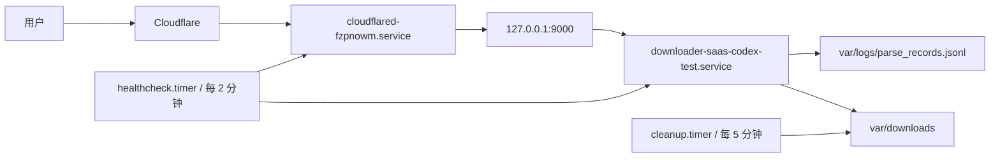

# SalaryMeow Downloader 生产交接文档

最后更新：2026-07-26  
当前生产运行代码基线：`662d782`（文档以 `main` 最新提交为准）  
GitHub：<https://github.com/f3271174706-tech/SalaryMeow-Downloader>

## 1. 当前结论

- 重构版已经成为唯一在线生产版本。
- 生产入口：<https://fzpnowm.top>
- 管理后台：<https://fzpnowm.top/admin>
- 旧站 `downloader.fzp.me` 已退役，当前返回 Cloudflare 530。
- 旧项目、旧 systemd unit 和旧隧道配置仍保留，但都处于停止、禁用状态。
- 旧项目的最终 627 条解析记录已迁移到新项目；新项目此后继续写入同一份新文件。
- Admin 登录页使用 FZP 液态玻璃外壳；登录后保留旧项目的浅色统计、筛选和记录表格布局。
- Admin 使用 scrypt 密码哈希、HMAC-SHA256 签名会话和 Strict/Secure/HttpOnly Cookie。

## 2. 生产拓扑


```mermaid
flowchart LR
    U["用户"] --> C["Cloudflare"]
    C --> T["cloudflared-fzpnowm.service"]
    T --> A["127.0.0.1:9000"]
    A --> P["downloader-saas-codex-test.service"]
    P --> R["var/logs/parse_records.jsonl"]
    P --> D["var/downloads"]
    H["healthcheck.timer / 每 2 分钟"] --> P
    H --> T
    K["cleanup.timer / 每 5 分钟"] --> D
```

| 入口 | 状态 | 后端 |
|---|---|---|
| `https://fzpnowm.top` | 在线、主站 | `127.0.0.1:9000` |
| `https://fzpnowm.top/admin` | 在线、新 Admin | 同一 FastAPI 进程 |
| `https://downloader.fzp.me` | 退役 | 旧隧道已停止 |

## 3. 服务器与目录

SSH：

```powershell
ssh -i "C:\Users\32711\.ssh\id_ed25519" -p 51918 root@103.236.92.6
```

| 路径 | 用途 |
|---|---|
| `/root/downloader-saas-codex-test` | 当前生产项目 |
| `/root/downloader-saas-codex-test/.venv` | Python 虚拟环境 |
| `/root/downloader-saas-codex-test/app.env` | 生产环境变量，权限应为 `600` |
| `/root/downloader-saas-codex-test/config.yaml` | 平台 Cookie 与解析配置，权限应为 `600` |
| `/root/downloader-saas-codex-test/var/logs/parse_records.jsonl` | 当前解析记录，权限 `600` |
| `/root/downloader-saas-codex-test/var/downloads` | 临时下载与预下载文件 |
| `/root/DOWN` | 已停用旧项目，仅用于回滚 |
| `/root/DOWN/logs/parse_records.jsonl` | 旧项目停机时的最终记录快照 |
| `/root/salarymeow-cutover-backup-20260726-091331` | 本次正式切换备份 |

备份目录权限为 `700`，含：

- 新项目切换前源码压缩包；
- 新旧记录文件与 SHA-256 校验清单；
- 新旧应用、隧道的 systemd unit；
- 切换前 `app.env`、`config.yaml` 和旧 Admin 环境文件；
- 切换前服务启用/运行状态。

## 4. systemd 服务

| Unit | 当前状态 | 开机启动 | 用途 |
|---|---|---|---|
| `downloader-saas-codex-test.service` | active | enabled | FastAPI 主服务 |
| `cloudflared-fzpnowm.service` | active | enabled | `fzpnowm.top` 隧道 |
| `downloader-saas-codex-test-healthcheck.timer` | active | enabled | 每 2 分钟健康检查和有限自愈 |
| `downloader-saas-codex-test-cleanup.timer` | active | enabled | 每 5 分钟清理过期临时文件 |
| `douyin-dl.service` | inactive | disabled | 旧项目，保留回滚 |
| `cloudflared-downloader-fzpme.service` | inactive | disabled | 旧域名隧道，保留回滚 |

常用命令：

```bash
systemctl status downloader-saas-codex-test.service --no-pager
systemctl status cloudflared-fzpnowm.service --no-pager
systemctl list-timers --all | grep downloader-saas
journalctl -u downloader-saas-codex-test.service -n 100 --no-pager
journalctl -u downloader-saas-codex-test-healthcheck.service -n 50 --no-pager
```

手动验证运维任务：

```bash
systemctl start downloader-saas-codex-test-healthcheck.service
systemctl start downloader-saas-codex-test-cleanup.service
systemctl show downloader-saas-codex-test-healthcheck.service \
  downloader-saas-codex-test-cleanup.service \
  -p Id -p Result -p ExecMainStatus
```

期望两个任务均为 `Result=success`、`ExecMainStatus=0`。

## 5. Admin

Admin 与主站使用同一 FastAPI 进程，不再依赖旧项目。

主要接口：

| 方法 | 路径 | 用途 |
|---|---|---|
| GET | `/api/public/config` | Admin 展示配置 |
| POST | `/api/admin/login` | 登录 |
| GET | `/api/admin/session` | 当前会话 |
| POST | `/api/admin/logout` | 退出 |
| GET | `/api/admin/overview` | 总量、今日量、平台统计 |
| GET | `/api/admin/records` | 最近解析记录 |

安全机制：

- 密码只以 scrypt 哈希写入 `app.env`；
- Admin 使用独立的 `FZP_SESSION_SECRET`；
- Cookie 名为 `fzp_admin_session`；
- 生产 Cookie 启用 `Secure`、`HttpOnly`、`SameSite=Strict`；
- 登录与退出校验 `Origin`；
- 单 IP 在 15 分钟内连续失败 5 次会被临时限流；
- Admin 页面与所有设计资源均为本地静态文件，不依赖外部 CDN。

原账号密码仍可登录，但原密码只有 9 位。建议尽快改为至少 12 位。生成新哈希时在项目目录执行：

```bash
cd /root/downloader-saas-codex-test
PYTHONPATH=src .venv/bin/python -c \
  "from app.core.security import hash_admin_password; import getpass; print(hash_admin_password(getpass.getpass('New admin password: ')))"
```

将输出安全地写入 `app.env` 的 `FZP_ADMIN_PASSWORD_HASH`，不要把密码或哈希发到聊天、日志或 Git。修改后：

```bash
chmod 600 app.env
systemctl restart downloader-saas-codex-test.service
```

## 6. 解析记录

当前唯一写入文件：

```text
/root/downloader-saas-codex-test/var/logs/parse_records.jsonl
```

切换时：

- 旧文件停止写入后的最终条数为 627；
- SHA-256 与备份中的 `legacy-final-parse_records.jsonl` 一致；
- 新文件权限设为 `600`；
- `DOUYIN_RECORDS_MAX_FILE_BYTES=0`，当前不自动轮转，避免静默丢失历史记录。

检查：

```bash
wc -l /root/downloader-saas-codex-test/var/logs/parse_records.jsonl
tail -n 3 /root/downloader-saas-codex-test/var/logs/parse_records.jsonl
stat -c '%a %U:%G %s %y' /root/downloader-saas-codex-test/var/logs/parse_records.jsonl
```

记录含公网 IP 和粗略地区，属于需要受控保存的数据。不要公开该文件；备份和导出时保持最小权限。

## 7. 平台解析机制

| 平台 | 主要技术与策略 |
|---|---|
| 抖音 | 默认 f2 API-only；空数据、异常或超时仅切换一次 Cookie；启动时预热 f2 |
| Bilibili | 官方 Web/API 数据、Cookie、音视频流处理；媒体 URL 通过本站流式代理 |
| 快手 | 页面/接口解析与 Cookie |
| TikTok | TikTokApi 为主，解析环境使用 Playwright；仅 TikTok 使用本机/服务器配置代理 |
| X/Twitter | 页面/接口解析；仅 X 使用配置代理 |

通用机制：

- 10 分钟元数据缓存；
- 有边界的智能预下载；
- 下载、流媒体、解析并发限制；
- 流媒体来源校验、重定向限制和最大字节数；
- Range 请求；
- 可信代理链下的真实客户端 IP；
- CSP、安全响应头和本地前端资源。

## 8. Cookie 更新

平台 Cookie 保存在：

```text
/root/downloader-saas-codex-test/config.yaml
```

更新流程：

1. 先备份配置；
2. 只替换目标平台对应 Cookie；
3. 保持权限 `600`；
4. 重启主服务；
5. 查看健康检查和日志；
6. 用一条公开链接做该平台解析验收。

```bash
cp -a config.yaml "config.yaml.bak.$(date +%Y%m%d-%H%M%S)"
chmod 600 config.yaml
systemctl restart downloader-saas-codex-test.service
curl -fsS http://127.0.0.1:9000/health/ready
journalctl -u downloader-saas-codex-test.service -n 80 --no-pager
```

Cookie、Admin 密码、会话密钥和 Tunnel Token 禁止提交 Git。

## 9. 发布流程

生产目录不是 Git 工作树。推荐从已推送提交构建归档并上传：

```powershell
git status --short
git archive --format=tar.gz -o "$env:TEMP\salarymeow-release.tar.gz" HEAD
scp -i "C:\Users\32711\.ssh\id_ed25519" -P 51918 `
  "$env:TEMP\salarymeow-release.tar.gz" `
  root@103.236.92.6:/root/
```

发布前确认 `git status` 干净，且 `.gitattributes` 保持 Linux 脚本为 LF。服务器端：

```bash
systemctl stop downloader-saas-codex-test.service
tar -xzf /root/salarymeow-release.tar.gz -C /root/downloader-saas-codex-test
/root/downloader-saas-codex-test/.venv/bin/pip install -r /root/downloader-saas-codex-test/requirements.txt
systemctl start downloader-saas-codex-test.service
curl -fsS http://127.0.0.1:9000/health/ready
systemctl start downloader-saas-codex-test-healthcheck.service
```

不要覆盖：

- `.venv/`
- `app.env`
- `config.yaml`
- `var/`

## 10. 验收清单

```bash
curl -fsS http://127.0.0.1:9000/health/live
curl -fsS http://127.0.0.1:9000/health/ready
curl -fsS -o /dev/null -w '%{http_code}\n' https://fzpnowm.top/
curl -fsS -o /dev/null -w '%{http_code}\n' https://fzpnowm.top/admin
curl -fsS -o /dev/null -w '%{http_code}\n' https://fzpnowm.top/admin-assets/app.js
```

还应人工验证：

- Admin 登录、退出、统计与记录筛选；
- 新解析记录出现真实 IP 与地区字段；
- 抖音普通视频、图集/动图；
- Bilibili 预览、Range 和下载；
- 快手、TikTok、X；
- 浏览器控制台没有阻断业务的 CSP、混合内容或脚本错误。

## 11. 回滚

本次切换的回滚根目录：

```text
/root/salarymeow-cutover-backup-20260726-091331
```

优先回滚当前新服务源码：

```bash
systemctl stop downloader-saas-codex-test.service
tar -xzf /root/salarymeow-cutover-backup-20260726-091331/new-source-before.tar.gz \
  -C /root/downloader-saas-codex-test
cp -a /root/salarymeow-cutover-backup-20260726-091331/app.env \
  /root/downloader-saas-codex-test/app.env
cp -a /root/salarymeow-cutover-backup-20260726-091331/config.yaml \
  /root/downloader-saas-codex-test/config.yaml
systemctl daemon-reload
systemctl start downloader-saas-codex-test.service
```

如果必须恢复旧站：

```bash
systemctl enable --now douyin-dl.service
systemctl enable --now cloudflared-downloader-fzpme.service
```

旧站恢复后入口为 `downloader.fzp.me`。这只是应急回滚，不应让两个项目长期同时写同一记录文件。

执行回滚前先备份当前新增记录，避免回滚过程丢失切换后的数据。

## 12. 已知事项

- Admin 仍是单账号、单角色，不支持 RBAC。
- Admin 会话是无状态签名 Token，密钥不变时无法单独撤销某一个会话。
- 登录限流在单进程内存中；当前 Uvicorn 为 1 worker，因此行为稳定，但重启会清空失败计数。
- 旧 Admin 密码强度偏低，需要主动轮换。
- 记录文件当前不轮转，应制定备份、保留期限和归档策略。
- `downloader.fzp.me` DNS 仍存在，但隧道已停；确认不再需要回滚后再删除 DNS、Tunnel 和旧目录。
